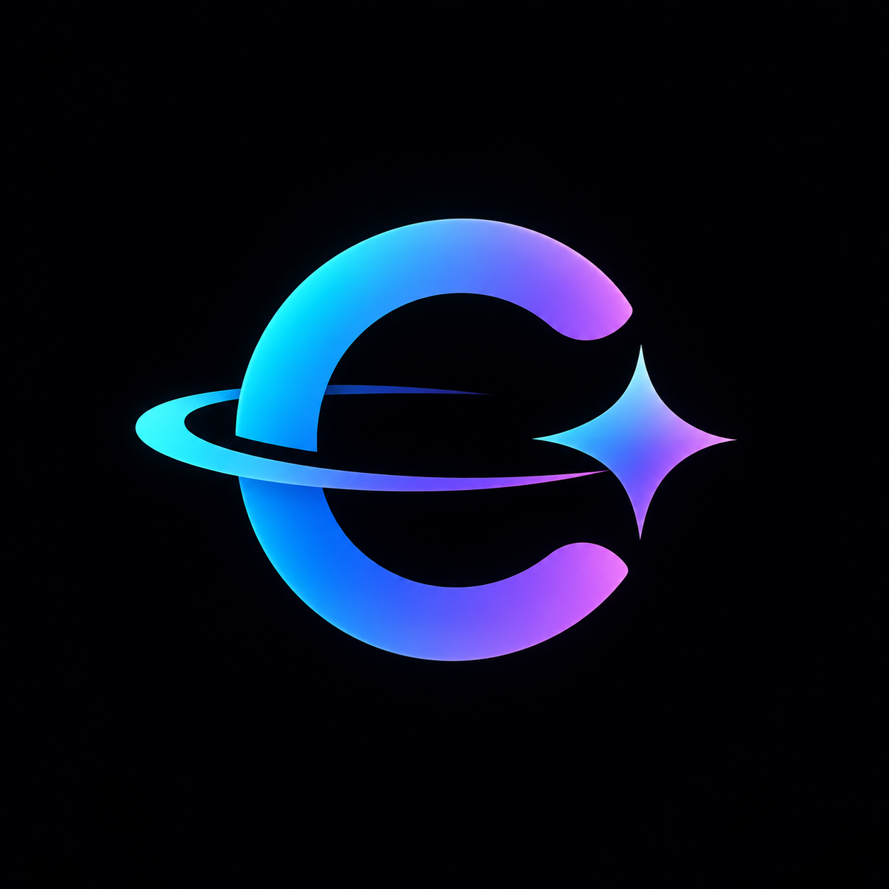

<p align="center">
  
</p>

<h1 align="center">CodeHalo</h1>

<p align="center">
  <strong>Your AI coding agents, at a glance.</strong>
</p>

<p align="center">
  <a href="https://github.com/sreevarshan-xenoz/codehalo/actions"></a>
  <a href="LICENSE"></a>
  <a href="https://www.rust-lang.org/"></a>
  <a href="https://www.qt.io/"></a>
  <a href="https://github.com/sreevarshan-xenoz/codehalo/stargazers"></a>
</p>

<p align="center">
  A lightweight, hardware-accelerated desktop HUD overlay for <strong>Windows and Linux</strong> that monitors your active AI coding sessions (Claude Code, OpenAI Codex, Cursor, Gemini/Antigravity, and more) with zero web bloat.
</p>

---

## ⚡ Highlights

- 🛸 **Native Desktop HUD**: Direct GPU-accelerated Qt 6 Quick / QML interface. No Electron, no WebView2, and no browser tabs.
- 🦀 **Rust Core Engine**: Ultra-fast background metrics monitoring, low memory footprint, and high-performance cross-platform threading.
- 🖥️ **Cross-Platform**: Designed from day one for **Windows 10/11** and **Linux** (Wayland-native with X11 fallback).
- 📌 **Always In Reach**: Frameless, translucent, edge-docked screen pill with instant click-to-expand metrics drawer.
- 🔒 **Local & Private**: All agent telemetry, session tokens, and local cache remain strictly on your machine.

---

## 🏗️ Architecture

CodeHalo is built on a strict separation of concerns:
> **Rust owns the system logic. QML owns the presentation.**

```text
┌─────────────────────────────────────────────────────────┐
│                      Rust Core                          │
│   • Provider Observers (Claude, Cursor, Codex, etc.)    │
│   • Token & Cost Accounting Engine                      │
│   • Local Storage & Config (Rusqlite, Serde)            │
└────────────────────────────┬────────────────────────────┘
                             │  CXX-Qt Bridge
┌────────────────────────────▼────────────────────────────┐
│                  Qt 6 Quick / QML UI                    │
│   • Frameless Edge HUD Window                           │
│   • Fluid 60/120 FPS State Animations                   │
│   • Hardware Compositing & Translucency                 │
└─────────────────────────────────────────────────────────┘
```

For complete technical specifications, see [ARCHITECTURE.md](ARCHITECTURE.md).

---

## 📦 Building from Source

### Prerequisites

| Tool | Version Requirement |
| :--- | :--- |
| **Rust** | `1.75+` (with `cargo`) |
| **Qt 6** | `6.5+` (`Qt6Core`, `Qt6Gui`, `Qt6Quick`, `Qt6Qml`, `Qt6Widgets`, `Qt6QuickWidgets`) |
| **CMake** | `3.22+` |
| **C++ Compiler** | GCC 13+ (MinGW-w64 on Windows) or MSVC 2022 / Clang 16+ |

### Build Instructions

```bash
# Clone repository
git clone https://github.com/sreevarshan-xenoz/codehalo.git
cd codehalo

# Configure CMake
cmake -B build -S .

# Compile CodeHalo executable
cmake --build build --config Release
```

The compiled binary will be located in `build/codehalo` (or `build/codehalo.exe` on Windows).

---

## 🗺️ Roadmap

- [x] **Milestone 1**: Native Rust + Qt 6 Quick foundation and CXX-Qt bridge.
- [x] **Milestone 1.1**: Frameless, edge-docked translucent HUD window proof-of-concept.
- [ ] **Milestone 2**: Multi-monitor detection, edge docking (Top/Bottom/Left/Right), and tray icon.
- [ ] **Milestone 3**: Provider telemetry integration (Claude Code, Cursor CLI, OpenAI Codex).
- [ ] **Milestone 4**: Linux Wayland layer-shell protocol integration.

---

## 🤝 Contributing

Contributions are welcome! Please check out [CONTRIBUTING.md](CONTRIBUTING.md) to get started with our development guidelines and pull request workflow.

---

## 📄 License

CodeHalo is open source under the [MIT License](LICENSE).
